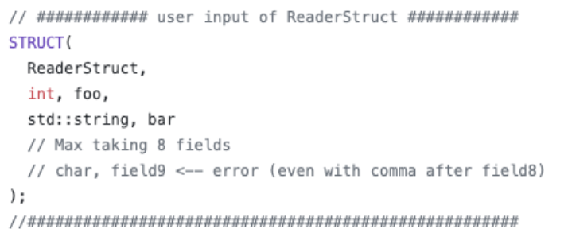
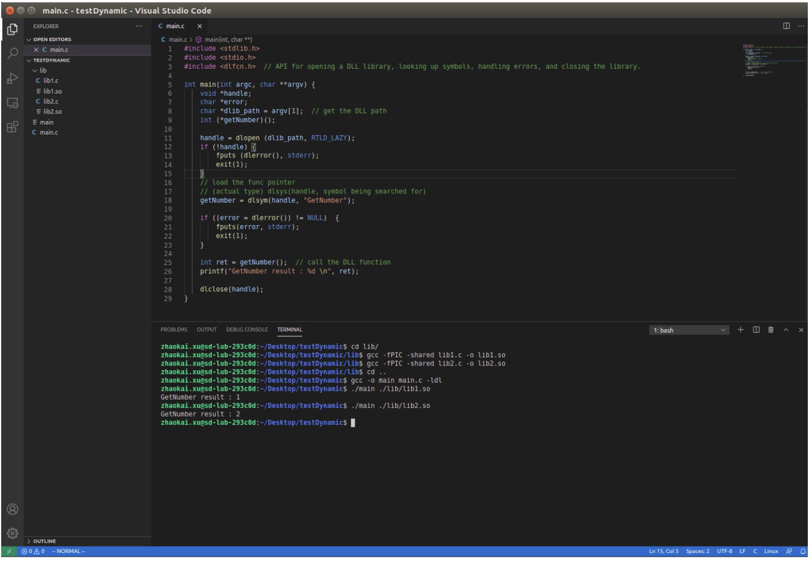
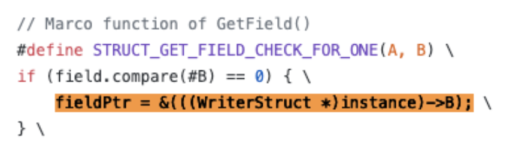
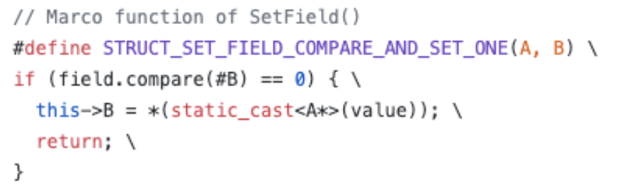
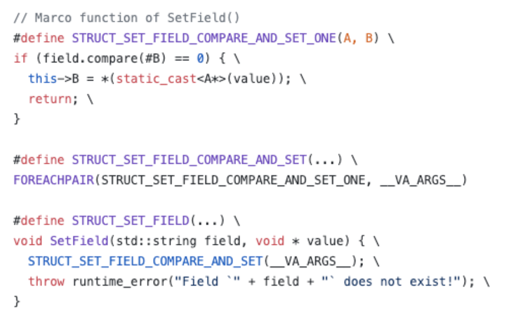

# TuSimple-Intern-Project
> Dataset2 Dynamic Deserialization Project

## Summary
The goal of this project is to provide a solution that allows the user to compile once and open most datasets and any new dataset concerning different data types(ROS or Zoro) and the message versions of ROS and Zoro. It can save the user’s time in recompiling user code that reads the dataset in different types and different message versions. It should support downgrade and upgrade compatibility of message versions.

We proposed 4 solutions for solving the problem, and after analyzing the pros and cons, we chose the first option that mainly uses the technology of C++ dynamic plugins and a reflection system to dynamically deserialize data at runtime. The first option has the advantages of being low coupled and requiring no change on the current codebase, but it requires the user to define the message struct for storing the deserialized data.

## Motivation (Problem Statement)
Currently, the Dataset2 project in C++ version does not support the compatibility of deserializing messages in different dataset types (ROS or Zoro) or different message versions. The deserialization function will throw an exception complaining about the mismatch of the message struct at runtime.
This is because every serialized message belonging to a specific dataset type and message version has its message struct, and we do not know all the message struct the user will need for deserialization at compile-time. Using the initially compiled deserialization function will not work for deserializing messages in other message structs at runtime.
As a result, now the user has to recompile their user code again and again based on the dataset type and the message version the user wants to open. This is not user-friendly. The user wants to compile their user code once and open as many datasets as possible.
For example, while deserializing messages, if the user already compiled their user code that can deserialize the message in version  ROS@2.3, the user wants to be able to read any other dataset (ex. ROS@2.4,  ROS@2.5, ZORO@2.5).

## Prior researches
### Option1: Dynamic Message Plugins, Static User-Declared Memory Layout
Compile separate deserialization plugins for every message_type+ version
JIT or store with the dataset
Dynamically load the appropriate plugin at runtime  
The user declares fields they expect at compile time
Some parts of the library/plugin figure out how to map the fields defined in the message to the fields declared by the user, probably using reflection.
### Option2: Dynamic Typing
Provide an interface like C++ JSON libraries for accessing fields in datasets
May require a custom deserialization library
### Option3: Historic Messages in octopus_msgs
Provide a package that includes all versions of messages
Enable users to handle separate message versions in one binary
### Option4: Upgrade Datasets when Messages Change
Provide tooling and automation to automatically recreate topics with different message format and version for datasets when it changes
Recompile when new formats are released


## Guide-level Explanation (Usage example)
### Major Procedures of the Project
#### The user defines the message struct called ReaderStruct.
#### The user provides the WriterStruct metadata of the serialized message payload.
#### The user calls the template function ‘deserialize<T>’ from the Reader.
##### The Reader generates a plugin at runtime based on the WriterStruct.
##### The Reader runs the plugin to deserialize the message with the WriterStruct.
##### The Reader uses the reflection system to transfer fields from WriterStruct to user-defined ReaderStruct in runtime memory.

### Step1:
The user defines ReaderStruct by filling the field types and field names in the file “readerStruct.h”. The ReaderStruct should be a subset of many WriterStructs they are interested in reading. 
The user also needs to fill in the ‘deserialize<T>’ template function with the ReaderStruct, so that the user can load fields from WriterStruct into the user-defined ReaderStruct when running the dynamic deserialization project, and then process data stored in the ReaderStruct.

For example, if the user knows the message struct of ROS@2.3 and this is what the user wants, the user can define the ReaderStruct by filling field types and field names from ROS@2.3. Then, the user uses the dynamic deserialization reader to read any other dataset (ex. ROS@2.4,  ROS@2.5, ZORO@2.5) into WriteStruct, and load data from WriterStruct to ReaderStruct.

```cpp
Struct ReaderStruct {	// ROS@2.3	
 type1 field1;
 type2 field2; 
};
```



### Step2:
The WriterStruct is defined by the Writer at the time the dataset is created. It is defined by the package installed in the docker that is running on the truck. The user needs to provides the metadata of WriterStruct in JSON files, which will be used for deserializing message payload.  

```cpp
struct WriterStruct_1 {	// ROS@2.4
type1 field1;
type2 field2;	
type3 field3;		// unused fields for the ReaderStruct
}
struct WriterStruct_2 {	// ROS@2.5
type1 field1;
type2 field2;	
type3 field3;		// unused fields for the ReaderStruct
type4 field4;		
}
```

### Step3:
At compile time, the user generates an executable Reader only once. The Reader has a compatible application binary interface(ABI) for accessing any dynamic plugin at runtime. This supports the transferring of data from the WriterStruct in a plugin to the ReaderStruct.

Since there is no way to know the WriterStruct of messages at compile-time, we develop a reflection system to map the fields in WriterStruct to fields in the user-defined ReaderStruct at runtime. 
At runtime, the Reader generates a new dynamic plugin at each time it tries to read a new dataset in a different message version based on the WriterStruct metadata file (/data/meta.json). 
Then, the Reader calls the plugin API Create to deserialize the message data into the WriterStructs and return a pointer to the WriterStruct.
    ```cpp
    void * Create(const vector<uint8_t> & msg_payload) 
    ```

After loading the WriterStruct into the runtime memory, and providing the field name, the Reader can obtain the address of the field in the WriterStruct by calling the plugin API GetField.
	```cpp
    void * GetField(void * writerStruct, string field) 
    ```

Finally, the reader loads data from WriterStruct to ReaderStruct by calling the two ReaderStruct APIs ListFields and SetField. ListFields is used for traversing the fields in ReaderStruct, and SetField is used for loading data stored in the field address obtained from “GetField” into the corresponding field in the ReaderStruct.
    ```cpp
    static vector<string> ListFields() 

    void SetField(string fieldName, void * value)
    ```

Example of the Reflection System
```cpp
ReaderStruct* deserialize<ReaderStruct>(Message msg) {	 	 
void* ws = plugin->Create(msg);
ReaderStruct* obj;
	 for (field in obj->ListFields()) {
	   obj->SetField(field, plugin->GetField(ws, field));	//load WriterStruct field into ReaderStruct field
	 }
	return obj;
}
```

### Design Diagram


## Usage example
```sh
./ build 	// run	 g++ -std=c++14 -o main main.cpp -ldl

./main		// will generate the DLL using command “g++ -fPIC -shared ” + dll_target_path + " -o " + dll_path;
```

## Reference level Explanation (Implementation details):
#### POC #1 - Load different dynamic plugins/dynamic loaded libraries at runtime based on some user input.
By providing two dynamic loaded library files that contain the same prototype of a function call “getNumber()” but returning different results, we verify that it is feasible to make a function call to “getNumber()” in the main program to obtain the result from each dynamic loaded library. 
Compile two C based dynamic plugins lib1.c and lib2.c with
    ```sh
    gcc   -fPIC  -shared lib1.c  -o lib1.so
    ```
Compile the C++ based main.cpp that is supported by the dynamic plugin with
    ```sh
 	g++  -std=c++14  -o	 main 	main.cpp  -ldl
    ```
Execute main.c by passing lib1.so as a parameter like
    ```sh
    ./main  lib1.so 
    ```
    


#### POC #2 - Automatically transfer fields between the WriterStruct and ReaderStruct at runtime using a reflection system
In this step, we developed a reflection system to allow transferring fields between the WriterStruct and ReaderStruct through the 5 APIs in runtime memory: 
ReaderStruct: ListFields and SetField 
    ```cpp
    static vector<string> ListFields() 
    void SetField(string fieldName, void * value)
    ```

Plugin: Create, GetField. Delete
    ```cpp
    void * Create(const vector<uint8_t> & msg_payload) 
    void * GetField(void * writerStruct, string field) 
    void  Delete(void * instance)
    ```

	To provide ABI level compatibility, we use extern "C" in the dynamic plugin functions to makes a function-name in C++ have C linkage (the compiler does not mangle the name) so that client C code can link to (use) your function using a C compatible header file that contains just the declaration of your function. 
    Ref: https://tldp.org/HOWTO/C++-dlopen/thesolution.html#externC

    To transfer the value of an unknown type field from the dynamic plugin to the Reader, we use void* as the return type of both functions Create and GetField, Create() returns the address of the WriterStruct object allocated in heap, and GetField() returns the memory address of the field we want to read.
    We can not dereference the void *, so we need to cast the void * back to its original instance like (WriterStruct *)instance and then dereference it.

    Similarly, after obtaining the memory address of a field from GetField, we cast the field obtained from WriteStruct to the target field in ReaderStruct.


#### POC #3 - Automatically insert methods in a struct definition that are required by POC #2 using C++ macros. 
In POC#2, we manually write out the functions for each ReaderStruct. But in POC3#, we write a macro to build the functions automatically at compile time.

The advantage of using C++ macro is to help shorten the user code to define the ReaderStruct and its relevant functions, such as SetField and ListFields. C++ Macro help expand the syntax sugar definition of functions at compile time. 
Ref: https://gcc.gnu.org/onlinedocs/cpp/Variadic-Macros.html#Variadic-Macros

	For example, in the reader/readerStruct.h file, the user defines the ReaderStruct by filling the field types and field names.

    

    At compile time, the STRUCT above will be replaced by the following, including the definition of ReaderStruct, the definition of ListFields, and the definition of SetField.

    

    We use variadic macros to support the user inputting a list of arguments in macro struct and macro functions.
    Ref: https://gcc.gnu.org/onlinedocs/cpp/Variadic-Macros.html#Variadic-Macros

    Besides, we use a recursive macro to preprocess the variadic macro arguments and replace code statements with the tokenized macro arguments. We define the recursive macro helper functions in “gross.h”
	Ref: An example to tokenize an unknown number of macro arguments using recursive macro and feed into macro function   
https://gist.github.com/irondoge/9488bba0e8b170afbee96fbea84a976a

    For example, the SetField function needs to find the field with the same field name in ReaderStruct and WriterStruct, and then assign the value of the field obtained from the WriterStruct to the field in the ReaderStruct. To reduce the repeated step of string comparison and value assignment,   STRUCT_SET_FIELD_COMPARE_AND_SET_ONE(A, B)  will be recursively applied to each pair of the field type and the field value.
    

	The C++ macro can provide a simple interface for the user input, but its drawback is the number of fields that the user can fill into the ReaderStruct is bound by the max number of argus the recursive macro processor can support. Moreover, the macro function definitions look very tedious and are not easily understandable. We have an alternative that is building a preprocessor to interpret the user definition of ReaderStruct, but it is hard to implement, so we no longer consider it.

#### POC #4 - Generate a dynamic plugin at runtime from a source struct in a JSON file. 

    We read the metadata of WriterStruct from the JSON file using C++ boost.
    Ref: http://www.cochoy.fr/boost-property-tree/

    We use C++ I/O to read the template source code of any dynamic plugin from a template file, replace the template source code with the WriterStruct definition loaded from the JSON file, and write the plugin source code into a .cpp file. In this step, we are mainly working with C++ I/O and C++ string. 

    We automatically executing the compilation command to generate the plugin from its source file with popen(). This standard library function creates a half-duplex pipeline by calling pipe() internally. It then forks a child process, execs the Bourne shell, and executes the "command" argument within the shell.
    Ref: https://tldp.org/LDP/lpg/node12.html

	Lastly, 	we generate the path of the newly created dynamic plugin based on the unique number of the directory holding the metadata JSON file.

	For example, 	from “/data1/meta.json” we read the string “1” and generate the path for the dynamic plugin source code as:	“/lib/lib” + “1” + “.cpp” = “/lib/lib1.cpp”,  and generate the path for the dynamic plugin as:   “/lib/lib” + “1” + “.so” = “/lib/lib1.so”

#### POC #5 - Extend POC #4 to also apply a macro to source struct from JSON file.
    
    The C++ macro can also be applied to the WriterStruct, which provides more flexibility in filling the plugin functions: Create(), GetField(), and Delete(). 
    
    Since the user does not need to directly access the WriterStruct, the optimization using C++ macro might not be as necessary as POC #3. However, providing a simpler way of inputting WriterStruct fields can save effort in substituting WriterStruct fields into the Plugin source code.

####    To accomplish the project, due to the time limit, there are three steps left to be completed:

#### POC #6 - Extend POC #4 to generate the object from a protobuf message definition rather than the source struct.

####  POC #7 - Extend POC #4 to also include deserialization code for converting “vector<uint8_t>” to the source struct. This can be protobuf, ROS, or just casting the bytes to the struct.

####  POC #8 - Combine everything into a single `deserialize<T>` template function for end users.