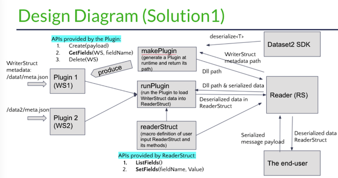

# Dynamic Deserialization Project

## Summary
The goal of this project is to provide a solution that allows the user to compile once and open most datasets and any new dataset concerning different data types(ROS or Zoro) and the message versions of ROS and Zoro. It can save the user’s time in recompiling user code that reads the dataset in different types and different message versions. It should support downgrade and upgrade compatibility of message versions.

We proposed 4 solutions for solving the problem, and after analyzing the pros and cons, we chose the first option that mainly uses the technology of C++ dynamic plugins and a reflection system to dynamically deserialize data at runtime. The first option has the advantages of being low coupled and requiring no change on the current codebase, but it requires the user to define the message struct for storing the deserialized data.

## Motivation (Problem Statement)
Currently, the Dataset2 project in C++ version does not support the compatibility of deserializing messages in different dataset types (ROS or Zoro) or different message versions. The deserialization function will throw an exception complaining about the mismatch of the message struct at runtime.
This is because every serialized message belonging to a specific dataset type and message version has its message struct, and we do not know all the message struct the user will need for deserialization at compile-time. Using the initially compiled deserialization function will not work for deserializing messages in other message structs at runtime.
As a result, now the user has to recompile their user code again and again based on the dataset type and the message version the user wants to open. This is not user-friendly. The user wants to compile their user code once and open as many datasets as possible.
For example, while deserializing messages, if the user already compiled their user code that can deserialize the message in version  ROS@2.3, the user wants to be able to read any other dataset (ex. ROS@2.4,  ROS@2.5, ZORO@2.5).

## Prior researches
#### Option1: Dynamic Message Plugins, Static User-Declared Memory Layout
Compile separate deserialization plugins for every message_type+ version
JIT or store with the dataset
Dynamically load the appropriate plugin at runtime  
The user declares fields they expect at compile time
Some parts of the library/plugin figure out how to map the fields defined in the message to the fields declared by the user, probably using reflection.
#### Option2: Dynamic Typing
Provide an interface like C++ JSON libraries for accessing fields in datasets
May require a custom deserialization library
#### Option3: Historic Messages in octopus_msgs
Provide a package that includes all versions of messages
Enable users to handle separate message versions in one binary
#### Option4: Upgrade Datasets when Messages Change
Provide tooling and automation to automatically recreate topics with different message format and version for datasets when it changes
Recompile when new formats are released


## Guide-level Explanation (Usage example)
### Major Procedures of the Project
1. The user defines the message struct called ReaderStruct.
2. The user provides the WriterStruct metadata of the serialized message payload.
3. The user calls the template function ‘deserialize<T>’ from the Reader.
    3.1 The Reader generates a plugin at runtime based on the WriterStruct.
    3.2 The Reader runs the plugin to deserialize the message with the WriterStruct.
    3.3 The Reader uses the reflection system to transfer fields from WriterStruct to user-defined ReaderStruct in runtime memory.

### Step1:
The user defines ReaderStruct by filling the field types and field names in the file “readerStruct.h”. The ReaderStruct should be a subset of many WriterStructs they are interested in reading. 
The user also needs to fill in the ‘deserialize<T>’ template function with the ReaderStruct, so that the user can load fields from WriterStruct into the user-defined ReaderStruct when running the dynamic deserialization project, and then process data stored in the ReaderStruct.

For example, if the user knows the message struct of ROS@2.3 and this is what the user wants, the user can define the ReaderStruct by filling field types and field names from ROS@2.3. Then, the user uses the dynamic deserialization reader to read any other dataset (ex. ROS@2.4,  ROS@2.5, ZORO@2.5) into WriteStruct, and load data from WriterStruct to ReaderStruct.

```cpp
Struct ReaderStruct {	// ROS@2.3	
 type1 field1;
 type2 field2; 
};
```

### Step2:
The WriterStruct is defined by the Writer at the time the dataset is created. It is defined by the package installed in the docker that is running on the truck. The user needs to provides the metadata of WriterStruct in JSON files, which will be used for deserializing message payload.  

```cpp
struct WriterStruct_1 {	// ROS@2.4
type1 field1;
type2 field2;	
type3 field3;		// unused fields for the ReaderStruct
}
struct WriterStruct_2 {	// ROS@2.5
type1 field1;
type2 field2;	
type3 field3;		// unused fields for the ReaderStruct
type4 field4;		
}
```

### Step3:
At compile time, the user generates an executable Reader only once. The Reader has a compatible application binary interface(ABI) for accessing any dynamic plugin at runtime. This supports the transferring of data from the WriterStruct in a plugin to the ReaderStruct.

Since there is no way to know the WriterStruct of messages at compile-time, we develop a reflection system to map the fields in WriterStruct to fields in the user-defined ReaderStruct at runtime. 

At runtime, the Reader generates a new dynamic plugin at each time it tries to read a new dataset in a different message version based on the WriterStruct metadata file (/data/meta.json). 
Then, the Reader calls the plugin API Create to deserialize the message data into the WriterStructs and return a pointer to the WriterStruct.
    
```cpp
void * Create(const vector<uint8_t> & msg_payload) 
```

After loading the WriterStruct into the runtime memory, and providing the field name, the Reader can obtain the address of the field in the WriterStruct by calling the plugin API GetField.
	
```cpp
void * GetField(void * writerStruct, string field) 
```

Finally, the reader loads data from WriterStruct to ReaderStruct by calling the two ReaderStruct APIs ListFields and SetField. ListFields is used for traversing the fields in ReaderStruct, and SetField is used for loading data stored in the field address obtained from “GetField” into the corresponding field in the ReaderStruct.

```cpp
static vector<string> ListFields() 

void SetField(string fieldName, void * value)
```

Example of the Reflection System

```cpp
ReaderStruct* deserialize<ReaderStruct>(Message msg) {	 	 
void* ws = plugin->Create(msg);
ReaderStruct* obj;
    for (field in obj->ListFields()) {
    obj->SetField(field, plugin->GetField(ws, field));	//load WriterStruct field into ReaderStruct field
    }
    return obj;
}
```

### Design Diagram


## Usage example
```sh
./ build 	// run	 g++ -std=c++14 -o main main.cpp -ldl

./main		// will generate the DLL using command “g++ -fPIC -shared ” + dll_target_path + " -o " + dll_path;
```

## Reference level Explanation (Implementation details):
#### POC #1 - Load different dynamic plugins/dynamic loaded libraries at runtime based on some user input.

#### POC #2 - Automatically transfer fields between the WriterStruct and ReaderStruct at runtime using a reflection system

#### POC #3 - Automatically insert methods in a struct definition that are required by POC #2 using C++ macros. 

#### POC #4 - Generate a dynamic plugin at runtime from a source struct in a JSON file. 

#### POC #5 - Extend POC #4 to also apply a macro to source struct from JSON file.

#### POC #6 - Extend POC #4 to generate the object from a protobuf message definition rather than the source struct.

####  POC #7 - Extend POC #4 to also include deserialization code for converting “vector<uint8_t>” to the source struct. This can be protobuf, ROS, or just casting the bytes to the struct.

####  POC #8 - Combine everything into a single `deserialize<T>` template function for end users.